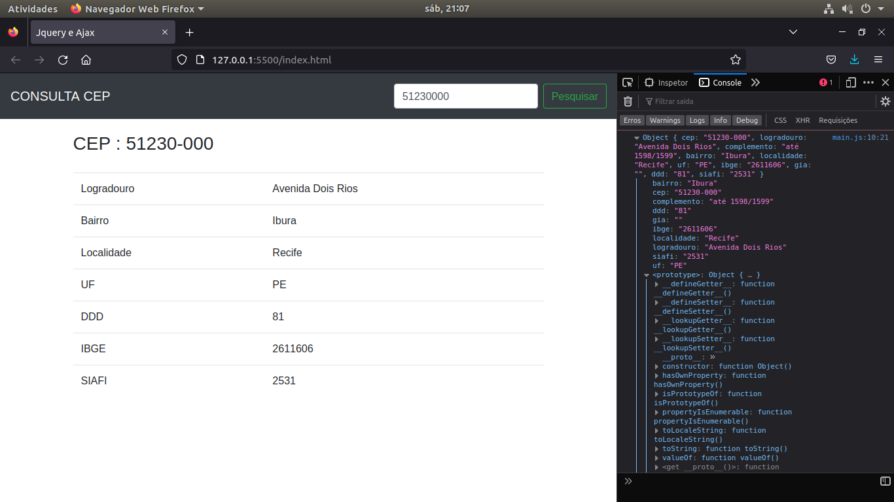

# Jquery-e-Ajax
### Introdução a biblioteca Jquery 
#
### Criando Interface para Cusulta Cep

#
### Tela Inicial
#

#

- Interface intregada a uma url para buscar informações de CEP

- As informações são listdas em uma tabela
- Projeto prático de estudo
- Introdução á Biblioteca jquery e Ajax para requisição dos Cep
